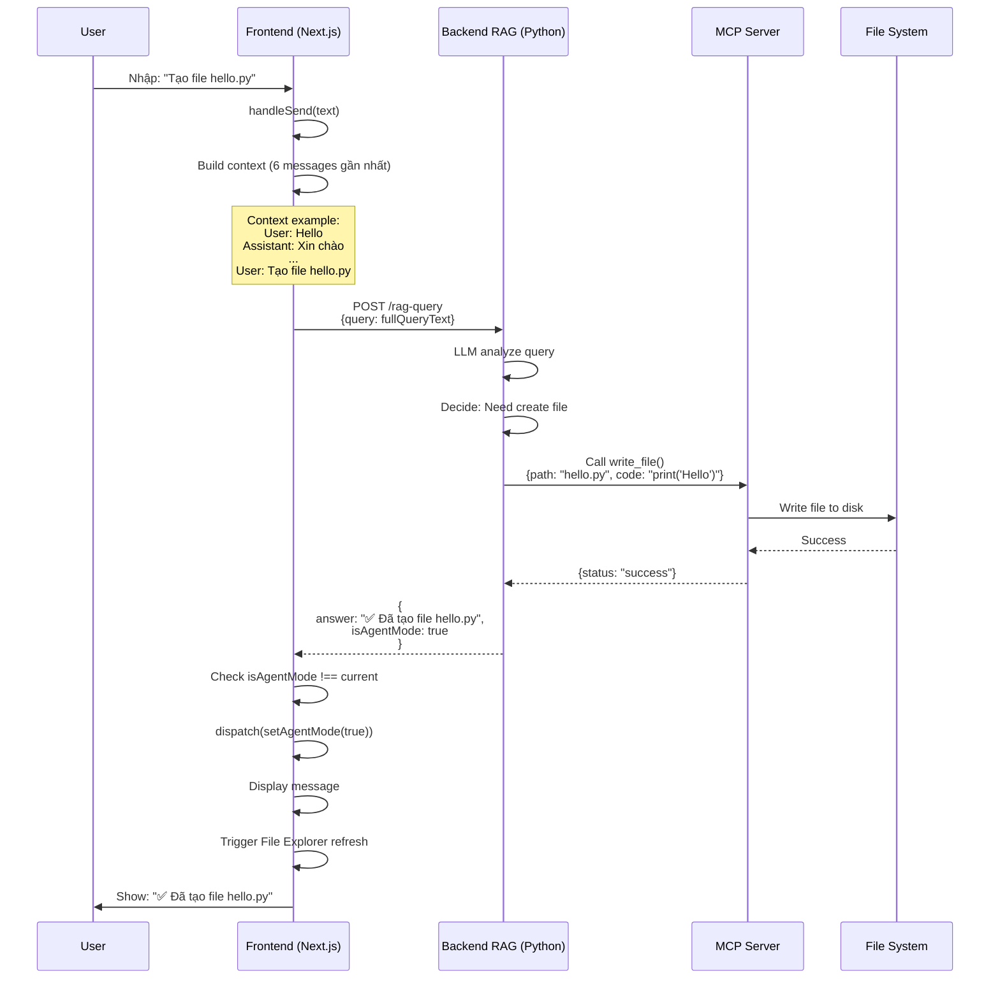
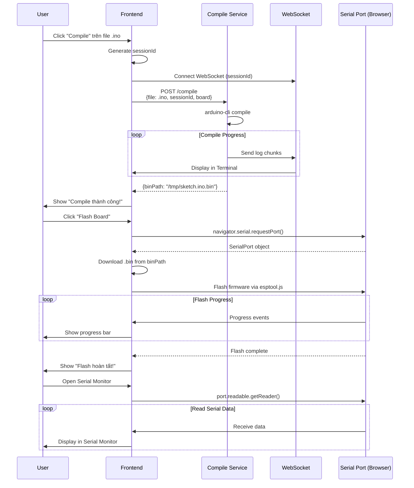
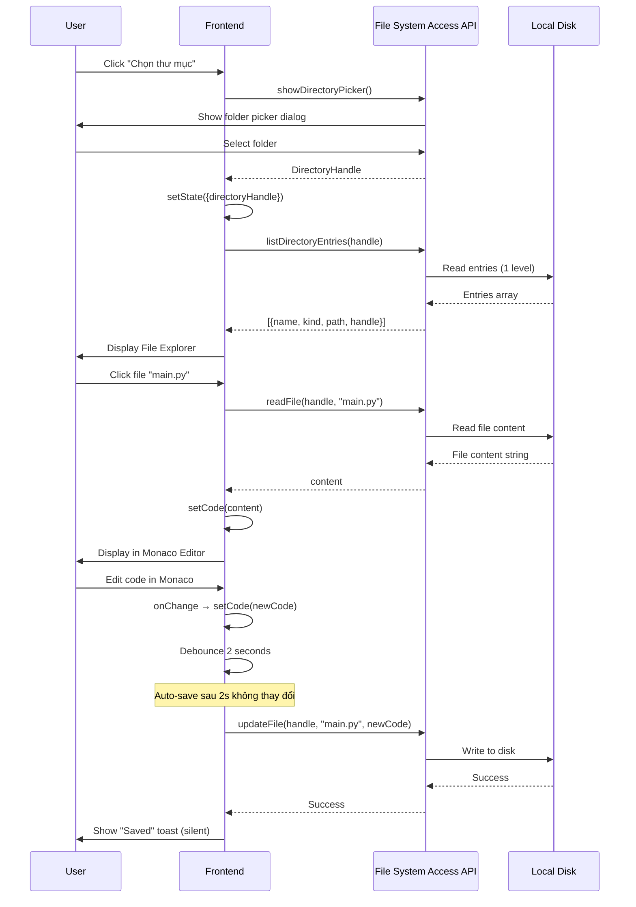

# 📚 Giải Thích Chi Tiết Cấu Trúc và Luồng Hoạt Động - Chatbot RAG

> **Kiến trúc:** MCP (Model Context Protocol) Architecture  
> **Ngày cập nhật:** 12/11/2025  
> **Trạng thái:** Sau refactoring - Clean Architecture

---

## 📋 Mục Lục

1. [Tổng Quan Kiến Trúc](#1-tổng-quan-kiến-trúc)
2. [Cấu Trúc Thư Mục](#2-cấu-trúc-thư-mục)
3. [Kiến Trúc MCP](#3-kiến-trúc-mcp)
4. [Hai Chế Độ Hoạt Động](#4-hai-chế-độ-hoạt-động)
5. [Luồng Hoạt Động Chi Tiết](#5-luồng-hoạt-động-chi-tiết)
6. [Các Component Chính](#6-các-component-chính)
7. [State Management](#7-state-management)
8. [API Integration](#8-api-integration)
9. [File System Integration](#9-file-system-integration)
10. [Arduino Development Workflow](#10-arduino-development-workflow)

---

## 1. Tổng Quan Kiến Trúc

### 1.1 Tech Stack

```
Frontend:
├── Next.js 15.5.5 (App Router)
├── React 19
├── TypeScript
├── Redux Toolkit (State Management)
├── Monaco Editor (VS Code Editor)
├── Tailwind CSS + shadcn/ui
└── Framer Motion (Animations)

Backend Services:
├── RAG Query Service (Python FastAPI)
├── Database Service (PostgreSQL)
├── Compile Service (Spring Boot - Arduino)
├── MCP Server (Node.js)
└── File System (Browser API)
```

### 1.2 Kiến Trúc Tổng Thể

```
┌────────────────────────────────────────────────────────────────┐
│                        BROWSER (Chrome/Edge)                   │
│                                                                │
│  ┌───────────────────────────────────────────────────────────┐ │
│  │              Frontend (Next.js App)                       │ │
│  │                                                           │ │
│  │  ┌──────────────┐         ┌──────────────────────────┐    │ │
│  │  │  Chat UI     │         │  IDE Panel (Monaco)      │    │ │
│  │  │  (Messages)  │         │  - File Explorer         │    │ │
│  │  │              │         │  - Code Editor           │    │ │
│  │  │  - Input     │         │  - Terminal Output       │    │ │
│  │  │  - History   │         │  - Serial Monitor        │    │ │
│  │  └──────────────┘         └──────────────────────────┘    │ │
│  │         │                            │                    │ │
│  │         │                            │                    │ │
│  │         └────────────┬───────────────┘                    │ │
│  │                      │                                    │ │
│  │           ┌──────────▼──────────┐                         │ │
│  │           │  Redux Store        │                         │ │
│  │           │  - chatSlice        │                         │ │
│  │           │  - isAgentMode      │                         │ │
│  │           └─────────────────────┘                         │ │
│  │                      │                                    │ │
│  └──────────────────────┼────────────────────────────────────┘ │
│                         │                                      │
│                         │ HTTP/WebSocket                       │
└─────────────────────────┼──────────────────────────────────────┘
                          │
        ┌─────────────────┼─────────────────┐
        │                 │                 │
        ▼                 ▼                 ▼
┌──────────────┐  ┌──────────────┐  ┌──────────────┐
│ RAG Service  │  │ MCP Server   │  │ Compile      │
│ (Python)     │  │ (Node.js)    │  │ Service      │
│              │  │              │  │ (Spring)     │
│ - Query LLM  │  │ - write_file │  │              │
│ - Decide     │  │ - read_file  │  │ - arduino-   │
│   actions    │  │ - compile    │  │   cli        │
│              │  │ - flash      │  │ - Build .bin │
└──────────────┘  └──────────────┘  └──────────────┘
        │                 │                 │
        └─────────────────┴─────────────────┘
                          │
                          ▼
                  ┌──────────────┐
                  │  MongoDB     │
                  │  Database    │
                  └──────────────┘
```

---

## 2. Cấu Trúc Thư Mục

### 2.1 Frontend Structure

```
chatbot-rag/
├── app/
│   ├── (protected)/
│   │   └── [idChat]/
│   │       └── page.tsx          ← Main Chat Page
│   ├── api/
│   │   ├── ragQuery.ts           ← RAG API calls
│   │   ├── arduinoCompile.ts     ← Compile API
│   │   ├── messageFetch.ts       ← Message CRUD
│   │   └── chatFetch.ts          ← Chat CRUD
│   ├── layout.tsx
│   └── providers.tsx             ← Redux Provider
│
├── components/
│   └── component/
│       ├── ChatMessage.tsx       ← Message bubble
│       ├── ChatInput.tsx         ← Input with file upload
│       ├── IDECode.tsx           ← Monaco Editor + File Explorer
│       ├── IDEPanel.tsx          ← Terminal + Serial Monitor
│       └── FlashBoard.tsx        ← Flash firmware to board
│
├── hooks/
│   ├── use-file-system.ts        ← File System Access API wrapper
│   ├── useDebounce.ts            ← Auto-save debouncing
│   └── usePageTitle.ts           ← Dynamic page title
│
├── lib/
│   ├── fileSystemAPI.ts          ← Low-level File System API
│   ├── agentSystem.ts            ← Export SerialPortManager
│   └── serialPortManager.ts      ← Web Serial API wrapper
│
├── store/
│   ├── store.ts                  ← Redux store config
│   └── chatSlice.ts              ← Chat state (isAgentMode, input, file)
│
├── types/
│   ├── message.ts                ← Message interface
│   ├── chat.ts                   ← Chat interface
│   └── agentSettings.ts          ← AgentResponse (minimal)
│
└── mcp-server/                   ← MCP Server (Node.js)
    ├── index.ts                  ← MCP Server entry point
    ├── tools/
    │   ├── write_file.ts
    │   ├── read_file.ts
    │   ├── compile_arduino.ts
    │   └── flash_firmware.ts
    └── package.json
```

### 2.2 Key Files Removed (Refactoring)

```diff
- lib/agentActionHandler.ts           (560 lines) - Frontend action executor
- lib/codeParser.ts                   (160 lines) - Markdown parser
- components/component/ActionConfirmDialog.tsx    - Confirmation dialog
- components/component/AgentSettingsPanel.tsx     - Agent settings UI
- hooks/use-agent-settings.ts                     - Agent settings hook
- docs/AGENT_ACTION_SYSTEM.md                     - Old architecture docs
- docs/BACKEND_TO_IDE_FLOW.md
- docs/backend_response_examples.py
- FILE_SYSTEM_INTEGRATION.md
```

---

## 3. Kiến Trúc MCP

### 3.1 MCP là gì?

**MCP (Model Context Protocol)** là kiến trúc mới cho phép Backend RAG **tự execute actions** trên máy user thông qua **MCP Server**, thay vì trả về JSON actions cho Frontend execute.

### 3.2 So Sánh: Trước vs Sau MCP

#### ❌ **Trước MCP** (Old Architecture)

```
User: "Tạo file hello.py với print('Hello')"
         │
         ▼
┌────────────────────┐
│  Backend RAG       │
│  - LLM analyze     │
│  - Return JSON:    │
│    {               │
│      "actions": [  │
│        {           │
│          "type":   │
│           "write", │
│          "path":   │
│           "hello.  │
│            py",    │
│          "code":   │
│           "print   │
│           ('Hello')│
│        }           │
│      ]             │
│    }               │
└────────────────────┘
         │
         ▼
┌────────────────────┐
│  Frontend          │
│  - Parse JSON      │
│  - Show confirm    │
│  - Execute write   │  ← Frontend làm việc Backend nên làm
│  - Update UI       │
└────────────────────┘
```

#### ✅ **Sau MCP** (New Architecture)

```
User: "Tạo file hello.py với print('Hello')"
         │
         ▼
┌────────────────────┐
│  Backend RAG       │
│  - LLM analyze     │
│  - Call MCP:       │
│    write_file(     │
│      "hello.py",   │
│      "print(...)"  │
│    )               │  ← Backend tự execute
│  - Return result:  │
│    {               │
│      "answer":     │
│       "✅ Đã tạo  │
│        file",      │
│      "isAgentMode":│
│        true        │
│    }               │
└────────────────────┘
         │
         ▼
┌────────────────────┐
│  MCP Server        │
│  - Execute write   │
│  - Save to disk    │
│  - Return status   │
└────────────────────┘
         │
         ▼
┌────────────────────┐
│  Frontend          │
│  - Display result  │  ← Chỉ hiển thị, không execute
│  - Update UI       │
└────────────────────┘
```

### 3.3 Ưu Điểm MCP

| Tiêu chí                   | Trước MCP                          | Sau MCP                              |
| -------------------------- | ---------------------------------- | ------------------------------------ |
| **Separation of Concerns** | ❌ Frontend execute business logic | ✅ Backend execute, Frontend display |
| **Security**               | ❌ Frontend có quyền write file    | ✅ MCP Server control permissions    |
| **Code Complexity**        | ❌ ~800 lines Frontend code        | ✅ ~50 lines (minimal response)      |
| **Error Handling**         | ❌ Frontend + Backend both handle  | ✅ Backend centralized handling      |
| **Scalability**            | ❌ Hard to add new actions         | ✅ Easy to add MCP tools             |

---

## 4. Hai Chế Độ Hoạt Động

### 4.1 **Agent Auto Mode** (`isAgentMode = true`)

**Mô tả:** AI tự động execute actions qua MCP Server

**UI Layout:**

```
┌─────────────────────────────────────────────────────────┐
│                     Browser Window                      │
├──────────────────────────┬──────────────────────────────┤
│  IDE Panel (75% width)   │   Chat Panel (25% width)     │
│                          │                              │
│  ┌────────────────────┐  │  ┌────────────────────────┐  │
│  │ File Explorer      │  │  │ Messages               │  │
│  │ - src/             │  │  │                        │  │
│  │   - hello.py       │  │  │ User: Tạo hello.py     │  │
│  │   - main.py        │  │  │                        │ │
│  │                    │  │  │ Agent: ✅ Đã tạo file  │ │
│  └────────────────────┘  │  │        hello.py        │ │
│                          │  │                        │ │
│  ┌────────────────────┐  │  └────────────────────────┘ │
│  │ Monaco Editor      │  │                              │
│  │ print('Hello')     │  │  ┌────────────────────────┐ │
│  │                    │  │  │ Input                  │ │
│  └────────────────────┘  │  └────────────────────────┘ │
│                          │                              │
│  ┌────────────────────┐  │                              │
│  │ Terminal Output    │  │                              │
│  │ Compile success!   │  │                              │
│  └────────────────────┘  │                              │
└──────────────────────────┴──────────────────────────────┘
```

**Luồng hoạt động:**

1. User gửi message: "Tạo file LED blink cho Arduino"
2. Backend RAG:
   - LLM phân tích → quyết định cần tạo file
   - Call MCP Server: `write_file("led_blink.ino", code)`
   - MCP Server tạo file trên máy user
   - Return: `{answer: "✅ Đã tạo file led_blink.ino", isAgentMode: true}`
3. Frontend:
   - Nhận `isAgentMode: true` → set Redux state
   - Hiển thị IDE Panel (75% width) + Chat Panel (25% width)
   - Display message: "✅ Đã tạo file led_blink.ino"
   - File Explorer tự động refresh → hiện file mới

### 4.2 **User Manual Mode** (`isAgentMode = false`)

**Mô tả:** User tự chỉnh sửa code qua IDE Panel, không có AI auto actions

**UI Layout:**

```
┌─────────────────────────────────────────────────────────┐
│                     Browser Window                      │
│                                                         │
│            Chat Panel (Full Width - Centered)           │
│                                                         │
│         ┌──────────────────────────────────┐            │
│         │ Messages                         │            │
│         │                                  │            │
│         │ User: Hello                      │            │
│         │                                  │            │
│         │ Agent: Xin chào! Tôi có thể      │            │
│         │        giúp gì cho bạn?          │            │
│         │                                  │            │
│         └──────────────────────────────────┘            │
│                                                         │
│         ┌──────────────────────────────────┐            │
│         │ Input                            │            │
│         └──────────────────────────────────┘            │
│                                                         │
└─────────────────────────────────────────────────────────┘
```

**Luồng hoạt động:**

1. User gửi message: "Hello, bạn là ai?"
2. Backend RAG:
   - LLM trả lời câu hỏi thông thường
   - Không cần execute actions
   - Return: `{answer: "Xin chào! Tôi là PTIT Agent...", isAgentMode: false}`
3. Frontend:
   - Nhận `isAgentMode: false` → set Redux state
   - Hiển thị Chat Panel full width (centered)
   - IDE Panel hidden

**Khi nào User Manual Mode hữu ích?**

- User muốn tự chỉnh sửa code (không cần AI auto)
- User đang debug, cần tự control
- User muốn xem file, copy code, tự compile

---

## 5. Luồng Hoạt Động Chi Tiết

### 5.1 Luồng Chat với MCP



### 5.2 Luồng Arduino Development



### 5.3 Luồng File System (Manual Mode)



---

## 6. Các Component Chính

### 6.1 `page.tsx` - Main Chat Page

**Vị trí:** `app/(protected)/[idChat]/page.tsx`

**Chức năng chính:**

- Hiển thị chat interface
- Xử lý gửi message + file upload
- Quản lý `isAgentMode` state
- Responsive layout (Agent Mode: IDE + Chat, Manual Mode: Chat full)

**Key Code:**

```tsx
const handleSend = async (text: string, file?: File | undefined) => {
  // 1. Add user message
  const userMsg: Message = { role: MessageRole.USER, content: text };
  await addMessage(userMsg, params.idChat as UUID);
  setMessages((prev) => [...prev, userMsg]);

  // 2. Upload file nếu có
  if (file) {
    const uploadRes = await uploadRagFile(file);
    fileId = uploadRes.data.file;
  }

  // 3. Build context từ 6 messages gần nhất
  const last6Messages = messages.slice(-6);
  const contextText = last6Messages
    .map(
      (msg) =>
        `${msg.role === MessageRole.USER ? "User" : "Assistant"}: ${
          msg.content
        }`
    )
    .join("\n");

  const fullQueryText = contextText
    ? `Lịch sử hội thoại:\n${contextText}\n\nCâu hỏi hiện tại:\nUser: ${text}`
    : text;

  // 4. Query Backend RAG (MCP Client tự execute)
  const queryRes: { data: AgentResponse } = await ragQuery(fullQueryText);

  // 5. Check isAgentMode từ response
  if (
    queryRes.data.isAgentMode !== undefined &&
    queryRes.data.isAgentMode !== isAgentMode
  ) {
    dispatch(setAgentMode(queryRes.data.isAgentMode));
  }

  // 6. Display kết quả
  const botMsg: Message = {
    role: MessageRole.ASSISTANT,
    content:
      formatMarkdown(queryRes.data.answer) ?? "Không có phản hồi từ server",
  };
  setMessages((prev) => [...prev, botMsg]);
};
```

**Responsive Layout:**

```tsx
return (
  <div className="flex flex-col h-full">
    {/* Messages container */}
    <div
      className={`flex-1 pt-4 pb-40 overflow-y-auto ${
        isAgentMode
          ? "px-4" // Narrow padding khi có IDE Panel
          : "2xl:px-72 xl:px-44 lg:px-32 md:px-12 px-4" // Wide padding khi full chat
      }`}
    >
      {messages.map((m, index) => (
        <ChatMessage key={index} role={m.role} content={m.content} />
      ))}
    </div>

    {/* Input container */}
    <div
      className={`absolute bottom-0 ${
        isAgentMode ? "px-4" : "2xl:px-72 xl:px-44 lg:px-32 md:px-12 px-4"
      }`}
    >
      <ChatInput onSend={handleSend} disabled={loading} />
    </div>
  </div>
);
```

### 6.2 `IDECode.tsx` - Monaco Editor + File Explorer

**Vị trí:** `components/component/IDECode.tsx`

**Chức năng chính:**

- File Explorer với lazy loading
- Monaco Editor với auto-save (debounce 2s)
- Compile Arduino (.ino files)
- Flash firmware to board
- Serial Monitor integration

**Key Features:**

```tsx
// Lazy Loading - Chỉ load 1 level, expand folder mới load children
const toggleFolder = async (folderPath: string, entry: FileSystemEntry) => {
  if (expandedFolders.has(folderPath)) {
    // Collapse
    setExpandedFolders((prev) => {
      const newMap = new Map(prev);
      newMap.delete(folderPath);
      return newMap;
    });
  } else {
    // Expand - load children
    const children = await loadDirectoryEntries(entry.handle, folderPath);
    setExpandedFolders((prev) => {
      const newMap = new Map(prev);
      newMap.set(folderPath, children);
      return newMap;
    });
  }
};

// Auto-save với debounce
const debouncedCode = useDebounce(code, 2000);

useEffect(() => {
  const autoSave = async () => {
    if (!selectedFile || debouncedCode === undefined || loading) return;

    setIsSaving(true);
    const success = await updateFileContent(selectedFile, debouncedCode);

    if (success) {
      // Silent save - không toast
    } else {
      toast.error(`Lỗi khi lưu ${selectedFile.split("/").pop()}`);
    }
    setIsSaving(false);
  };
  autoSave();
}, [debouncedCode, selectedFile, loading, updateFileContent]);

// Compile Arduino
const handleCompileArduino = async () => {
  if (!selectedFile.endsWith(".ino")) {
    toast.error("Vui lòng chọn file .ino");
    return;
  }

  const newSessionId = `compile-${Date.now()}-${Math.random()
    .toString(36)
    .slice(2, 9)}`;
  setCompileSessionId(newSessionId);

  // Đợi WebSocket connect
  await new Promise((resolve) => setTimeout(resolve, 500));

  const blob = new Blob([code], { type: "text/plain" });
  const file = new File([blob], selectedFile.split("/").pop() || "sketch.ino");

  await compileArduino(file, newSessionId, selectedBoard);
  toast.success("Compile thành công!");
};
```

**Language Detection:**

```tsx
const langMap: Record<string, string> = {
  ts: "typescript",
  tsx: "typescript",
  js: "javascript",
  jsx: "javascript",
  c: "c",
  cpp: "cpp",
  ino: "c", // Arduino files
  py: "python",
  java: "java",
  cs: "csharp",
  html: "html",
  css: "css",
  json: "json",
  md: "markdown",
  // ... more
};
```

### 6.3 `use-file-system.ts` - File System Hook

**Vị trí:** `hooks/use-file-system.ts`

**Chức năng chính:**

- Wrapper cho File System Access API
- Quản lý directory handle state
- CRUD operations cho files
- Lazy loading entries

**Refactored Changes:**

```diff
+ // Chỉ giữ Manual Mode operations
+ const readFileContent = useCallback(async (fileName: string) => {...}, []);
+ const updateFileContent = useCallback(async (fileName: string, newCode: string) => {...}, []);
+ const deleteFileByName = useCallback(async (fileName: string) => {...}, []);
+ const createNewFile = useCallback(async (filePath: string, content: string) => {...}, []);

- // Đã xóa Auto-create functions (MCP Server làm việc này)
- const createFileFromCode = useCallback(async (fileName: string, code: string) => {...}, []);
- const createNestedFileFromCode = useCallback(async (filePath: string, code: string) => {...}, []);
- const processBackendCode = useCallback(async (markdown: string) => {...}, []);
```

**API Methods:**

| Method                              | Mô tả                       | Use Case                   |
| ----------------------------------- | --------------------------- | -------------------------- |
| `selectWorkingDirectory()`          | Mở folder picker dialog     | User chọn workspace        |
| `loadDirectoryEntries(handle?)`     | Load entries 1 level (lazy) | File Explorer render       |
| `loadFileList()`                    | Load tất cả files recursive | Search, indexing           |
| `readFileContent(fileName)`         | Đọc file content            | Click file trong Explorer  |
| `updateFileContent(fileName, code)` | Sửa file                    | Auto-save từ Monaco Editor |
| `deleteFileByName(fileName)`        | Xóa file                    | User delete file manual    |
| `createNewFile(filePath, content)`  | Tạo file mới                | User create file manual    |

### 6.4 `agentSettings.ts` - Minimal Types

**Vị trí:** `types/agentSettings.ts`

**Refactored (Minimal):**

```typescript
export interface AgentResponse {
  answer: string;
  isAgentMode?: boolean;
  // NOTE: Không còn 'actions' - Backend tự execute qua MCP
}
```

**Trước refactor (Deleted):**

```diff
- export interface AgentSettings {
-   enableAgent: boolean;
-   autoApprove: boolean;
-   permissions: {
-     allowFileOperations: boolean;
-     allowSystemCommands: boolean;
-   };
-   workingDirectory: string | null;
- }
-
- export interface AgentAction {
-   type: 'write_file' | 'read_file' | 'delete_file' | 'compile' | 'flash';
-   params: Record<string, any>;
- }
-
- export interface ActionResult {
-   success: boolean;
-   message: string;
-   data?: any;
- }
```

---

## 7. State Management

### 7.1 Redux Store Structure

**File:** `store/store.ts`

```typescript
import { configureStore } from "@reduxjs/toolkit";
import chatReducer from "./chatSlice";

export const store = configureStore({
  reducer: {
    chat: chatReducer,
  },
});

export type RootState = ReturnType<typeof store.getState>;
export type AppDispatch = typeof store.dispatch;
```

### 7.2 Chat Slice

**File:** `store/chatSlice.ts`

```typescript
import { createSlice, PayloadAction } from "@reduxjs/toolkit";

interface ChatState {
  input: string;
  file: File | null;
  refreshHistory: number;
  isAgentMode: boolean; // KEY STATE - Control UI layout
}

const initialState: ChatState = {
  input: "",
  file: null,
  refreshHistory: 0,
  isAgentMode: false,
};

export const chatSlice = createSlice({
  name: "chat",
  initialState,
  reducers: {
    setInput: (state, action: PayloadAction<string>) => {
      state.input = action.payload;
    },
    setFile: (state, action: PayloadAction<File | null>) => {
      state.file = action.payload;
    },
    clearChatState: (state) => {
      state.input = "";
      state.file = null;
    },
    triggerRefreshHistory: (state) => {
      state.refreshHistory += 1;
    },
    setAgentMode: (state, action: PayloadAction<boolean>) => {
      state.isAgentMode = action.payload; // Set từ Backend response
    },
  },
});

export const {
  setInput,
  setFile,
  clearChatState,
  triggerRefreshHistory,
  setAgentMode,
} = chatSlice.actions;

export default chatSlice.reducer;
```

**Sử dụng trong Component:**

```tsx
// Đọc state
const { isAgentMode } = useSelector((state: RootState) => state.chat);

// Dispatch action
const dispatch = useDispatch();
dispatch(setAgentMode(true));
```

---

## 8. API Integration

### 8.1 RAG Query API

**File:** `app/api/ragQuery.ts`

```typescript
import axios from "axios";
import { AgentResponse } from "@/types/agentSettings";

export async function ragQuery(
  query: string
): Promise<{ data: AgentResponse }> {
  const response = await axios.post<AgentResponse>(
    `${process.env.NEXT_PUBLIC_API_URL}/rag-query`,
    { query },
    {
      headers: { "Content-Type": "application/json" },
      withCredentials: true,
    }
  );
  return response;
}
```

**Backend Response Example:**

````json
{
  "answer": "✅ Đã tạo file hello.py với nội dung:\n```python\nprint('Hello World')\n```",
  "isAgentMode": true
}
````

### 8.2 Arduino Compile API

**File:** `app/api/arduinoCompile.ts`

```typescript
export async function compileArduino(
  file: File,
  sessionId: string,
  board: string
): Promise<{ binPath: string }> {
  const formData = new FormData();
  formData.append("file", file);
  formData.append("sessionId", sessionId);
  formData.append("board", board);

  const response = await axios.post(
    `${process.env.NEXT_PUBLIC_COMPILE_SERVICE_URL}/compile`,
    formData,
    {
      headers: { "Content-Type": "multipart/form-data" },
    }
  );

  return response.data;
}
```

**Compile Service Flow:**

```
Frontend                Compile Service (Spring Boot)
   │                           │
   ├─────POST /compile─────────►│
   │  {file, sessionId, board}  │
   │                            │
   │                            ├─── arduino-cli compile
   │                            │    --fqbn arduino:avr:uno
   │                            │    --output-dir /tmp/...
   │                            │
   │◄────WebSocket logs─────────┤
   │  "Compiling sketch..."     │
   │  "Linking..."              │
   │                            │
   │◄────Response───────────────┤
   │  {binPath: "/tmp/....bin"} │
   │                            │
```

### 8.3 Message CRUD API

**File:** `app/api/messageFetch.ts`

```typescript
export async function addMessage(
  message: Message,
  chatId: UUID
): Promise<void> {
  await axios.post(
    `${process.env.NEXT_PUBLIC_API_URL}/messages`,
    {
      chatId,
      role: message.role,
      content: message.content,
    },
    { withCredentials: true }
  );
}

export async function getMessages(chatId: UUID): Promise<Message[]> {
  const response = await axios.get(
    `${process.env.NEXT_PUBLIC_API_URL}/messages/${chatId}`,
    { withCredentials: true }
  );
  return response.data;
}
```

---

## 9. File System Integration

### 9.1 File System Access API

**Browser Support:** Chrome 86+, Edge 86+

**File:** `lib/fileSystemAPI.ts`

**Key Methods:**

```typescript
/**
 * Yêu cầu user chọn folder
 */
export async function selectDirectory(): Promise<FileSystemDirectoryHandle | null> {
  try {
    const handle = await window.showDirectoryPicker({
      mode: "readwrite",
    });
    return handle;
  } catch (error) {
    console.error("User cancelled directory picker");
    return null;
  }
}

/**
 * List entries 1 level (Lazy Loading)
 */
export async function listDirectoryEntries(
  dirHandle: FileSystemDirectoryHandle,
  basePath: string = ""
): Promise<FileSystemEntry[]> {
  const entries: FileSystemEntry[] = [];

  for await (const [name, handle] of dirHandle.entries()) {
    const path = basePath ? `${basePath}/${name}` : name;

    entries.push({
      name,
      kind: handle.kind,
      path,
      handle: handle.kind === "directory" ? handle : undefined,
    });
  }

  return entries.sort((a, b) => {
    // Folders first, then files
    if (a.kind !== b.kind) {
      return a.kind === "directory" ? -1 : 1;
    }
    return a.name.localeCompare(b.name);
  });
}

/**
 * Đọc file content
 */
export async function readFile(
  dirHandle: FileSystemDirectoryHandle,
  fileName: string
): Promise<string> {
  const pathParts = fileName.split("/");
  let currentHandle: FileSystemDirectoryHandle | FileSystemFileHandle =
    dirHandle;

  // Traverse nested folders
  for (let i = 0; i < pathParts.length - 1; i++) {
    currentHandle = await (
      currentHandle as FileSystemDirectoryHandle
    ).getDirectoryHandle(pathParts[i]);
  }

  // Get file handle
  const fileHandle = await (
    currentHandle as FileSystemDirectoryHandle
  ).getFileHandle(pathParts[pathParts.length - 1]);

  const file = await fileHandle.getFile();
  return await file.text();
}

/**
 * Ghi file (update hoặc create)
 */
export async function updateFile(
  dirHandle: FileSystemDirectoryHandle,
  fileName: string,
  content: string
): Promise<void> {
  const pathParts = fileName.split("/");
  let currentHandle: FileSystemDirectoryHandle = dirHandle;

  // Create nested folders if needed
  for (let i = 0; i < pathParts.length - 1; i++) {
    currentHandle = await currentHandle.getDirectoryHandle(pathParts[i], {
      create: true,
    });
  }

  // Create/update file
  const fileHandle = await currentHandle.getFileHandle(
    pathParts[pathParts.length - 1],
    { create: true }
  );

  const writable = await fileHandle.createWritable();
  await writable.write(content);
  await writable.close();
}
```

### 9.2 Permissions

**File System Access API yêu cầu user grant permissions:**

```typescript
// Khi selectDirectory(), browser tự hỏi permission
const handle = await window.showDirectoryPicker({ mode: "readwrite" });

// Kiểm tra permission
const permission = await handle.queryPermission({ mode: "readwrite" });
if (permission !== "granted") {
  // Request lại permission
  const newPermission = await handle.requestPermission({ mode: "readwrite" });
  if (newPermission !== "granted") {
    throw new Error("Permission denied");
  }
}
```

---

## 10. Arduino Development Workflow

### 10.1 End-to-End Flow

```
1. User viết code trong Monaco Editor (file .ino)
   │
   ▼
2. Click "Compile" button
   │
   ├─── Generate sessionId
   ├─── Connect WebSocket (sessionId)
   └─── POST /compile to Spring Boot Service
        │
        ├─── arduino-cli compile --fqbn <board>
        ├─── Output logs via WebSocket → Terminal
        └─── Return binPath
   │
   ▼
3. Click "Flash Board" button
   │
   ├─── navigator.serial.requestPort()
   ├─── User chọn COM port
   ├─── Download .bin file
   └─── Flash via esptool.js (Web Serial API)
   │
   ▼
4. Click "Serial Monitor" button
   │
   ├─── port.readable.getReader()
   └─── Display data trong Terminal Panel
```

### 10.2 Supported Boards

**File:** `components/component/IDECode.tsx`

```typescript
const SUPPORTED_BOARDS = [
  { fqbn: "arduino:avr:uno", name: "Arduino UNO", type: "UNO" },
  { fqbn: "arduino:avr:nano", name: "Arduino Nano", type: "UNO" },
  { fqbn: "arduino:avr:mega", name: "Arduino Mega", type: "UNO" },
  { fqbn: "esp8266:esp8266:generic", name: "ESP8266 Generic", type: "ESP8266" },
  { fqbn: "esp32:esp32:esp32", name: "ESP32 Dev Module", type: "ESP32" },
  { fqbn: "esp32:esp32:esp32s2", name: "ESP32-S2", type: "ESP32" },
  { fqbn: "esp32:esp32:esp32s3", name: "ESP32-S3", type: "ESP32" },
  { fqbn: "esp32:esp32:esp32c3", name: "ESP32-C3", type: "ESP32" },
];
```

### 10.3 WebSocket Compile Logs

**File:** `components/component/IDEPanel.tsx`

```typescript
useEffect(() => {
  if (!compileSessionId) return;

  const ws = new WebSocket(
    `${process.env.NEXT_PUBLIC_WS_URL}/compile-logs?sessionId=${compileSessionId}`
  );

  ws.onmessage = (event) => {
    const log = event.data;
    setCompileLogs((prev) => [...prev, log]);
  };

  ws.onclose = () => {
    console.log("WebSocket closed");
  };

  return () => ws.close();
}, [compileSessionId]);
```

### 10.4 Serial Port Communication

**File:** `lib/serialPortManager.ts`

```typescript
export class SerialPortManager {
  private port: SerialPort | null = null;
  private reader: ReadableStreamDefaultReader | null = null;

  async connect(baudRate: number = 9600): Promise<void> {
    // Request port
    this.port = await navigator.serial.requestPort();

    // Open connection
    await this.port.open({ baudRate });
  }

  async read(callback: (data: string) => void): Promise<void> {
    if (!this.port?.readable) return;

    this.reader = this.port.readable.getReader();

    try {
      while (true) {
        const { value, done } = await this.reader.read();
        if (done) break;

        // Decode bytes to string
        const text = new TextDecoder().decode(value);
        callback(text);
      }
    } catch (error) {
      console.error("Serial read error:", error);
    } finally {
      this.reader.releaseLock();
    }
  }

  async write(data: string): Promise<void> {
    if (!this.port?.writable) return;

    const writer = this.port.writable.getWriter();
    const encoder = new TextEncoder();
    await writer.write(encoder.encode(data));
    writer.releaseLock();
  }

  async disconnect(): Promise<void> {
    if (this.reader) {
      await this.reader.cancel();
      this.reader = null;
    }

    if (this.port) {
      await this.port.close();
      this.port = null;
    }
  }
}
```

---

## 11. Tổng Kết

### 11.1 Điểm Mạnh Kiến Trúc Hiện Tại

✅ **Separation of Concerns:**

- Backend execute business logic (via MCP Server)
- Frontend chỉ display và handle user input

✅ **Dual Mode Flexibility:**

- Agent Auto Mode: AI tự động tạo/sửa file
- User Manual Mode: User tự control qua IDE Panel

✅ **Clean Code:**

- Xóa ~800 lines Frontend action execution logic
- Types minimal, dễ maintain

✅ **Modern Browser APIs:**

- File System Access API (Chrome/Edge)
- Web Serial API (Arduino development)
- WebSocket (Real-time compile logs)

✅ **Scalability:**

- Dễ thêm MCP tools mới (Backend)
- Frontend không cần thay đổi khi thêm actions

### 11.2 Hạn Chế và Cải Tiến

⚠️ **Browser Support:**

- File System Access API chỉ Chrome/Edge
- Giải pháp: Fallback to upload/download files cho Firefox/Safari

⚠️ **Backend MCP Client:**

- Hiện tại chưa implement đầy đủ MCP Client trong Python RAG
- Cần: Tích hợp MCP SDK vào Backend RAG

⚠️ **Error Handling:**

- Cần robust error handling cho MCP communication failures
- Cần retry logic cho file operations

⚠️ **Testing:**

- Cần end-to-end testing cho Agent Auto Mode
- Cần unit tests cho file system operations

### 11.3 Roadmap

**Phase 1: Backend Integration**

- [ ] Implement MCP Client trong Python RAG
- [ ] Test MCP tools (write_file, compile_arduino, etc.)
- [ ] Add error handling và retry logic

**Phase 2: UI/UX Improvements**

- [ ] Add loading states cho file operations
- [ ] Improve File Explorer (search, filter)
- [ ] Add code diff viewer (before/after AI changes)

**Phase 3: Advanced Features**

- [ ] Multi-file editing (tabs)
- [ ] Git integration (commit, push)
- [ ] Code collaboration (WebRTC)
- [ ] AI code review

---

## 12. FAQ

**Q: Tại sao cần 2 modes (Agent Auto + User Manual)?**  
A: Để user có control flexibility. Agent Auto khi cần AI làm nhanh, User Manual khi cần tự debug/customize.

**Q: File System Access API có an toàn không?**  
A: Có. Browser yêu cầu user grant permission mỗi lần chọn folder. Không có quyền access folders khác.

**Q: MCP Server chạy ở đâu?**  
A: MCP Server chạy trên máy user (localhost). Backend RAG gọi MCP Server qua HTTP/WebSocket.

**Q: Arduino compile ở đâu?**  
A: Compile Service (Spring Boot) chạy trên server, sử dụng `arduino-cli`. Không compile trên browser.

**Q: Serial Monitor có thể gửi command?**  
A: Có. SerialPortManager có method `write(data)` để gửi command tới board.

**Q: Có thể deploy lên production?**  
A: Có. Nhưng cần:

- HTTPS (File System Access API yêu cầu secure context)
- WebSocket secure (wss://)
- CORS config đúng

---

**Tài liệu này được tạo bởi:** GitHub Copilot  
**Ngày:** 12/11/2025  
**Version:** 1.0 (Post-MCP Refactoring)
