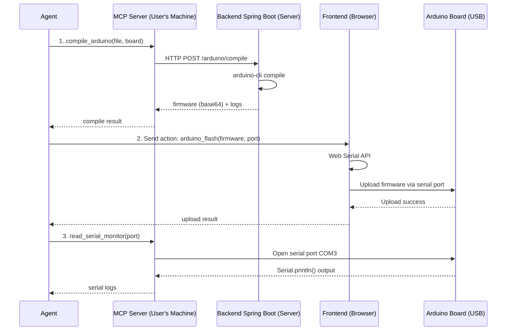

# Arduino MCP Server

MCP (Model Context Protocol) server cho phép AI Agent trực tiếp thực thi các thao tác với file và Arduino **trên máy user**.

## 🏗️ Kiến trúc phân tán

```
┌─────────────────────────────────┐
│      User's Machine             │
│                                 │
│  ┌─────────────────────────┐   │
│  │   MCP Server (Node.js)  │   │ ← Chạy trên máy user
│  │  - File operations      │   │
│  │  - Serial port access   │   │
│  │  - Upload firmware      │   │
│  └──────────┬──────────────┘   │
│             │                   │
│  ┌──────────▼──────────────┐   │
│  │  Arduino Board (USB)    │   │ ← Cắm vào máy user
│  │  COM3 / /dev/ttyUSB0    │   │
│  └─────────────────────────┘   │
└─────────────────────────────────┘
              │
              │ Network (HTTP/WebSocket)
              ▼
┌─────────────────────────────────┐
│         Server (Cloud)          │
│                                 │
│  ┌─────────────────────────┐   │
│  │ Backend Spring Boot     │   │ ← CHỈ compile code
│  │ - arduino-cli compile   │   │
│  │ - Return firmware       │   │
│  └─────────────────────────┘   │
└─────────────────────────────────┘
```

### Phân công công việc:

| Công việc               | Thực hiện bởi                 | Lý do                                                |
| ----------------------- | ----------------------------- | ---------------------------------------------------- |
| **Compile code**        | Backend Spring Boot           | Không cần hardware, chỉ cần arduino-cli              |
| **Upload firmware**     | **Frontend (Web Serial API)** | Browser có quyền truy cập serial port, không cần CLI |
| **Read serial monitor** | MCP Server                    | Serial port chỉ có trên máy user                     |
| **File operations**     | MCP Server                    | Truy cập file system trên máy user                   |

## Cài đặt

### 1. Cài đặt MCP Server

```bash
cd mcp-server
npm install
npm run build
```

## Sử dụng

### 1. Start MCP Server

```bash
WORKSPACE_ROOT=/path/to/arduino/workspace npm start
```

### 2. Config cho Python Agent

```python
from mcp import ClientSession, StdioServerParameters
from mcp.client.stdio import stdio_client

server_params = StdioServerParameters(
    command="node",
    args=["path/to/mcp-server/dist/index.js"],
    env={"WORKSPACE_ROOT": "/path/to/workspace"}
)

async with stdio_client(server_params) as (read, write):
    async with ClientSession(read, write) as session:
        await session.initialize()

        # Gọi tools
        result = await session.call_tool(
            "compile_arduino",
            arguments={
                "file": "sketch.ino",
                "board": "esp32:esp32:esp32"
            }
        )
```

## Tools có sẵn

### File Operations

#### read_file

Đọc nội dung file

```json
{
  "path": "sketch.ino"
}
```

#### write_file

Tạo hoặc cập nhật file

```json
{
  "path": "esp32_projects/blink.ino",
  "content": "void setup() { ... }"
}
```

#### delete_file

Xóa file

```json
{
  "path": "old_sketch.ino"
}
```

#### list_files

Liệt kê files trong thư mục

```json
{
  "path": "esp32_projects"
}
```

### Arduino Operations

#### compile_arduino

Compile Arduino code và nhận logs real-time từ Backend

```json
{
  "file": "sketch.ino",
  "board": "esp32:esp32:esp32"
}
```

Trả về:

```json
{
  "success": true,
  "sessionId": "mcp-123-abc",
  "logs": "Compile logs from Backend...",
  "firmware": "base64_firmware_data"
}
```

#### select_board

Chọn board mặc định

```json
{
  "board": "esp32:esp32:esp32"
}
```

### Serial Port Operations (Chạy trên máy user)

#### list_serial_ports

Liệt kê tất cả serial ports có sẵn trên máy user

```json
{}
```

Trả về:

```json
[
  {
    "path": "COM3",
    "manufacturer": "FTDI",
    "serialNumber": "A50285BI",
    "vendorId": "0403",
    "productId": "6001"
  }
]
```

#### read_serial_monitor

**Đọc serial logs từ Arduino board trên máy user** (không phải từ Backend)

```json
{
  "port": "COM3",
  "baudRate": 115200,
  "duration": 10
}
```

Trả về:

```json
{
  "port": "COM3",
  "baudRate": 115200,
  "duration": 10,
  "logs": "[2025-11-11T10:30:45.123Z] Hello from ESP32\n[2025-11-11T10:30:46.456Z] Temperature: 25.3C",
  "totalLines": 2
}
```

## Environment Variables

- `WORKSPACE_ROOT`: Thư mục làm việc Arduino (required)

## Yêu cầu

### Backend Requirements:

- Backend Compile Service chạy ở `localhost:2005`
- WebSocket endpoint: `ws://localhost:2005/ws/compile/{sessionId}`
- Backend có arduino-cli để compile

### MCP Server Requirements (User's Machine):

- Node.js 18+
- **Serial Port Access**: Quyền truy cập serial ports (COM ports hoặc /dev/ttyUSB\*)
- Arduino board được cắm vào USB

### Frontend Requirements (Browser):

- **Web Serial API** để upload firmware lên Arduino board
- Browser hỗ trợ: Chrome, Edge (Chromium-based browsers)

## Sự khác biệt: Backend Logs vs Serial Logs

### 📡 Backend Compile Logs (qua WebSocket)

- **Nguồn**: Backend Compile Service (Spring Boot)
- **Tool**: `compile_arduino`, `read_terminal_logs`
- **Nội dung**: Logs của quá trình compile (arduino-cli compile)
- **Transport**: WebSocket `ws://localhost:2005/ws/compile/{sessionId}`
- **Ví dụ logs**:
  ```
  Compiling sketch...
  Using board esp32:esp32:esp32
  Build complete
  Firmware size: 245KB
  ```

### 🔌 Serial Monitor Logs (từ Arduino board)

- **Nguồn**: Arduino board được cắm vào máy user qua USB
- **Tool**: `read_serial_monitor`
- **Nội dung**: Output từ code Arduino đang chạy (`Serial.println()`)
- **Transport**: Serial Port trực tiếp (COM3, /dev/ttyUSB0)
- **Ví dụ logs**:
  ```
  [2025-11-11T10:30:45.123Z] Hello from ESP32
  [2025-11-11T10:30:46.456Z] Temperature: 25.3C
  [2025-11-11T10:30:47.789Z] WiFi connected
  ```

### Workflow đầy đủ:



**Giải thích:**

1. **Compile** (Backend): Backend có arduino-cli compile code → trả firmware
2. **Upload** (Frontend): Agent gửi action cho Frontend → Web Serial API upload
3. **Monitor** (MCP Server): MCP Server đọc serial output từ Arduino đang chạy

## Backend WebSocket - Multiple Connections Support

Backend đã được cập nhật để hỗ trợ **multiple WebSocket connections per sessionId**:

### Trước khi sửa:

```java
Map<String, WebSocketSession> sessions  // Chỉ 1 connection/sessionId
```

- Nếu Frontend và MCP Server cùng kết nối với sessionId `compile-123`, connection thứ 2 sẽ **ghi đè** connection thứ 1
- Frontend hoặc Agent phải dùng sessionId khác nhau

### Sau khi sửa:

```java
Map<String, List<WebSocketSession>> sessions  // Nhiều connections/sessionId
```

- **Broadcast logs** tới TẤT CẢ clients đang kết nối với cùng sessionId
- Frontend và MCP Server có thể cùng kết nối với sessionId `compile-123`
- Mỗi client đều nhận được logs real-time

### Lợi ích:

✅ **Frontend** và **MCP Server Agent** có thể cùng theo dõi một compile session  
✅ Logs được broadcast tự động tới tất cả subscribers  
✅ Không cần tạo sessionId riêng biệt (fe-_, mcp-_)  
✅ Agent có thể monitor các compile sessions do người dùng tạo ra

### Ví dụ:

```typescript
// Frontend compile
const sessionId = "user-compile-123";
const ws1 = new WebSocket(`ws://localhost:2005/ws/compile/${sessionId}`);

// MCP Server cũng kết nối với cùng sessionId
const ws2 = new WebSocket(`ws://localhost:2005/ws/compile/${sessionId}`);

// Backend sẽ gửi logs tới CẢ ws1 VÀ ws2
```

### Thay đổi trong Backend:

**CompileWebSocketHandler.java:**

- `afterConnectionEstablished()`: Thêm session vào List thay vì ghi đè
- `sendLog()`: Broadcast tới tất cả sessions trong List
- `afterConnectionClosed()`: Chỉ xóa session cụ thể, giữ lại các sessions khác
- `getConnectionCount()`: Method mới để đếm số connections đang hoạt động
